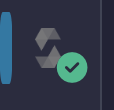

# Deploy a Smart Contract with Remix IDE

Learn how to write, compile, and deploy a Solidity smart contract using the Remix browser-based development environment.

## Overview
This tutorial describes how to use the **Remix Project** to deploy code to a simulated blockchain. You do not need prior programming experience or a cryptocurrency wallet to complete these steps.

### Objectives
* Create a workspace in the Remix IDE.
* Author a smart contract in the Solidity language.
* Deploy the contract to a virtual blockchain environment.

## Prerequisites
* A web browser (Chrome, Brave, or Firefox).
* An internet connection.
* Approximately 10 minutes.

## Step 1: Create the Contract File
1. Navigate to [Remix IDE](https://remix.ethereum.org/).
2. In the left navigation pane, choose the **File Explorer** icon (two stacked pages).
3. Under the **Workspaces** section, choose the **Create New File** icon (a page with a plus (+) sign).
4. In the text box, enter `HelloWorld.sol` and press **Enter**.

> **Note:** The `.sol` file extension identifies the file as a Solidity source file. Remix requires this extension to enable compilation and deployment features.

## Step 2: Add the Contract Code
Copy the following code and paste it into the `HelloWorld.sol` tab in the editor.

```solidity
// SPDX-License-Identifier: MIT
pragma solidity ^0.8.0;

contract HelloWorld {
    string public message = "Hello Web3!";
}
```
## Step 3: Compile the Contract
You must compile Solidity code into machine-readable bytecode before deployment.

1. In the left navigation pane, choose the Solidity Compiler icon (a hexagon).
2. Choose Compile HelloWorld.sol.
3. Verify that a green checkmark appears on the Solidity Compiler icon to confirm the build succeeded.



> [!IMPORTANT]
> You must remain on the **Solidity Compiler** tab to access the compile command. The button is not available in the **Search** or **File Explorer** tabs.

## Step 4: Deploy and Interact
1. In the left navigation pane, choose the Deploy & Run Transactions icon (Ethereum logo with an arrow).
2. For Environment, select Remix VM (Cancun).
3. Choose Deploy.
4. In the Deployed Contracts pane, choose the arrow to expand the HELLOWORLD contract.
5. Choose the blue message button to view the "Hello Web3!" output in the console.

## Troubleshooting

Review the following table to resolve common issues encountered during deployment.

| Issue | Resolution |
| :--- | :--- |
| **Declaration Error** | Verify that the contract name in the code matches your file name exactly. Solidity is case-sensitive. |
| **Compiler Error** | Look at the **Terminal** at the bottom of the interface. Red text indicates the specific line and character where a syntax typo occurred. |
| **Missing Deploy Button** | Ensure you successfully completed **Step 3**. You cannot deploy a contract until the green checkmark appears on the **Solidity Compiler** tab. |
| **Gas Estimation Failed** | Ensure the **Environment** is set to **Remix VM (Cancun)**. If using a real network, verify that your wallet contains sufficient testnet ETH. |

---

## Skills Demonstrated
This project highlights a specific set of technical communication and Web3 competencies:

* **Technical Writing & UX:** Translating abstract blockchain concepts (gas, smart contracts, compilation) into actionable, beginner-friendly steps.
* **Docs-as-Code Workflow:** Utilizing Markdown and GitHub as a primary documentation delivery system.
* **Web3 Tooling:** Hands-on experience navigating the Ethereum developer ecosystem (Solidity, Remix IDE, Virtual Machines).
* **Information Architecture:** Organizing complex technical procedures into a logical, scannable hierarchy with visual aids.

---
[⬆ Back to Top](#deploy-a-smart-contract-with-remix-ide)
